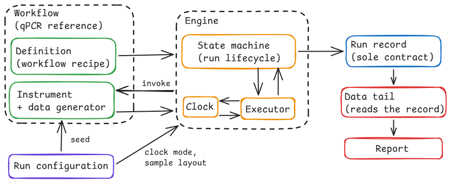

# Design: lab-orchestration

## Scope

This document describes the architecture of the orchestration engine and the
seams between it and the layers built on top of it: how a workflow is defined to
the engine, how the engine executes a run, how instruments and time are supplied
to it, and what a run produces. It assumes the requirements
(`docs/requirements.md`) and the accepted decision records (`docs/decisions/`).

One constraint runs through all of it: the engine is workflow-agnostic, and qPCR
is the reference workflow defined on top of it. Every seam below exists to keep
workflow-specific meaning out of the engine.

## Layers

- **Engine**, the workflow-agnostic orchestration spine. Executes a run and
  emits a record of it. Knows nothing about qPCR, about what its instruments do
  internally, or about downstream analysis.
- **Workflow**, the qPCR reference workflow: its instruments, the operations
  they perform, and the synthetic data they produce. Defined against the
  engine's interfaces; the engine never looks inside it.
- **Data tail**, the analysis layer. A separate consumer that reads a finished
  run's record and produces the analyses and the report. Runs after the engine,
  never during it (ADR 0001).

Instruments belong to the workflow and are driven by the engine through an
interface (ADR 0003). A sample-prep automation module is a later, optional
addition on top of this spine and is out of scope for this document.

## Core vocabulary

- **Workflow definition**, the recipe for a workflow: its instruments, the
  ordered program of steps with their declared durations, and the data model and
  parameters used to simulate it. Authored once and reused across runs.
- **Run configuration**, the per-invocation inputs: the random seed, the clock
  mode, and the sample/plate layout. Supplied fresh at each run. One definition
  can be run many times under different configurations.
- **Run record**, the persisted trace a run produces: what happened, plus the
  inputs that shaped it. The sole input to the data tail.

## The engine–workflow contract

A workflow definition fully describes a workflow, but the engine reads only the
part of it that crosses into the engine: the contract. Drawing that line is what
keeps workflow-specific meaning out of the engine: everything the engine reads
is generic, and everything qPCR-specific stays on the workflow side, unseen by
the engine.

The engine reads exactly three things from a workflow:

1. **Identity**, a name. The engine stores it in the run record as an opaque
   label and never interprets it.
2. **Instruments**, a set of handles, each satisfying the engine's instrument
   interface. The engine holds them and invokes operations on them without
   knowing what they are.
3. **Program**, the ordered thing the engine executes: a sequence of steps, and
   a loop construct that repeats a block of steps a fixed number of times. Each
   step names an instrument, an operation to invoke on it, a declared duration,
   and whether it acquires a reading.

Executing the program means walking it in order: advancing the clock over each
step's declared duration, invoking the step's operation on its instrument,
emitting an event as each step runs, and writing any acquired reading into the
run record.

Everything else in the definition stays on the workflow side, and the engine
never reads it: the data model and its parameters (used by the workflow's
synthetic generator) and the bodies of the operations (what each operation
actually does to its instrument). The seed and clock mode are not in the
definition at all, they are run configuration.

Validation checks that a submitted definition presents this structure: an
identity, instruments, and a well-formed program. A definition that does not is
rejected before any step runs.

Two properties of the program are load-bearing:

- **The loop belongs to the engine, not the instrument.** Repetition is generic
  orchestration, so the engine owns it. This is what makes the engine an
  orchestrator with real control flow rather than a component that forwards a
  single call and waits for a result. What each repeated step _means_ stays in
  the instrument.
- **Acquisition is a property of a step, independent of the loop.** A step
  acquires or it does not, whether or not it sits inside a loop. A workflow with
  no loop is simply the case where a block runs once; it still acquires, because
  acquisition rides on its steps. The absence of a loop never implies the
  absence of data.

## Execution: lifecycle and executor

Two responsibilities are easy to conflate but must stay separate: tracking what
state a run is in, and walking the program. They are two machines.

**The run lifecycle** is a small state machine, the same for every workflow. A
run is _pending_, then _running_, then it reaches exactly one terminal state:
_completed_ or _failed_, carrying a recorded reason. It transitions only on
outcome signals reported to it. It never sees the program's structure, the
schedule, or loop boundaries. This is the machine behind the requirement that
every run end in exactly one recorded terminal state and never silently continue
or stop.

**The executor** walks the program. It holds a cursor over the steps and the
loop counter, invokes each step's operation, advances the clock over the step's
declared duration, emits a per-step event, and reports each step's outcome to
the lifecycle machine. Loop re-entry is the executor's own arithmetic. The
lifecycle machine is never told about it.

Authority runs one way: the executor reports outcomes, and the lifecycle machine
decides whether the run continues or terminates. Two rules hold:

- **Fail-fast.** The first step that reports failure terminates the run as
  _failed_, with a recorded reason; no further steps run.
- **Outcome and event are distinct.** An outcome (success or failure) is the
  control signal that drives the next transition. An event is a traceability
  record emitted as steps run. They occur at the same moment but serve different
  purposes and are not one object.

The executor is built from the workflow definition; the seed and clock come from
run configuration. Two inputs, two sources.

## The instrument interface

There are two interfaces here, for two callers that need different things.

The **engine-facing interface** is what the executor holds, and it is
deliberately without vocabulary. The executor is workflow-agnostic and cannot
distinguish one operation from another. Through this interface it says one
thing: invoke this operation, for this duration, acquiring a reading if the step
acquires and return an outcome. The operation is opaque to the executor. It
invokes one by reference and receives an outcome, without knowing what
operations exist. The interface is kept no richer than "the engine needs no
change to run against a simulated instrument" requires (ADR 0003).

The **workflow's instrument implementation** sits behind that interface. This is
where operations are real. Where an abstract operation resolves to actual
instrument behaviour, and where the synthetic data generator lives. The executor
never sees inside it. All instrument meaning lives in the implementation. The
interface holds none of it. If meaning were in the interface, the engine could
see it, and the engine would no longer be workflow-agnostic.

Several rules keep this seam clean:

- **Operations are named as plain text and dispatched on.** A step names its
  operation as a string; the implementation dispatches on that string and
  rejects one it does not recognise, which surfaces when the step runs. A
  statically checked set of operation names is deferred: with a single workflow
  it would be machinery without payoff, and it can be added later as a local
  change if a second workflow ever makes it worthwhile.
- **The seed reaches the generator at construction, not through the interface.**
  The workflow's instrument is built already carrying its seed, so its generator
  is initialised before the engine touches it. The engine invokes operations on
  a ready instrument and never handles the seed itself. Routing the seed through
  the interface would force a seed onto the engine-facing surface and tell the
  engine that its instruments are stochastic. Workflow-specific knowledge the
  engine must not hold.
- **The instrument is reactive.** It knows how to perform an operation it is
  asked for; it does not know the program, the order of steps, or the loop
  count. Asked to perform an operation, it performs it and returns. Program
  structure lives only in the executor.
- **Acquisition is requested by the step and fulfilled by the instrument.**
  Because a step carries whether it acquires, the invocation carries that
  request, and the instrument returns a reading when asked. The instrument does
  not decide when acquisition happens; the program does.
- **A reading returns on the invocation.** An invocation returns an outcome:
  success or failure, together with a reading when the step acquired. The
  executor records it. Data flows through one path: one invocation in, one
  outcome out, recorded by the executor. There is no separate channel from
  instrument to record.

## Time

The engine holds time as a separate, injected dependency. The executor drives
it: it instructs the clock to advance by a step's declared duration, and the
clock does whatever advancing means for it. Under the default simulated clock,
advancing bumps an internal counter and returns immediately, so a run completes
in seconds. Under a wall-clock, advancing waits out the real duration and then
returns. The instruction is the same in both cases, only the real-time cost
differs (ADR 0002). The engine never reads wall-clock time or sleeps directly.
Timing enters only through this dependency.

The time written into the run record is logical protocol time: the timeline the
workflow declares, accumulated from its steps' declared durations. It is the
same regardless of clock mode. Logical time is a property of the protocol and is
reproducible across runs of the same configuration; real elapsed time is a
property of the machine on a given run and does not belong in the record. Clock
mode changes how long the operator waits, never the times recorded.

## The run record

The run record is the sole contract to the data tail. The data tail reads the
record and nothing else, and cannot call back into the engine, so anything a
consumer needs that the record does not hold is unreachable. The record is
therefore self-sufficient by design, and its contents are fixed by what its
consumers require rather than by capturing everything available.

Working backward from the consumers determines the contents. The analyses need,
for instance, per-well readings in cycle order to call thresholds, the identity
of the standard wells and their known quantities to build a standard curve, and
the unknowns' readings against that curve to quantify. That fixes the record:

- **Run identity**: the workflow name, as an opaque label.
- **Seed**: from run configuration; small, and required for reproducibility.
- **Event history**: the per-step events.
- **Readings**: each with its logical timestamp and its acquisition label.
- **Terminal state and reason.**
- **Sample/plate context**: which wells are standards, which are unknowns, and
  their known quantities: the inputs the analyses cannot run without.

The record deliberately excludes the engine's internal bookkeeping (cursor
state, loop counters, scheduling detail). It records what happened and the
inputs that shaped it, not how the executor tracked its progress. Just as the
engine does not know the data tail, the record does not expose engine mechanics
for the data tail to depend on. A field with no consumer does not belong in the
record.

The sample/plate context sits in run configuration rather than the workflow
definition because it varies from run to run while the workflow stays fixed: the
same workflow can be run against different layouts. It is recorded because the
record is the data tail's only source, and it entered as a genuine run input
rather than something the engine produced.

The workflow name is stored as a plain label. Choosing which analyses to run for
a given workflow is the data tail's own concern: it reads the name and maps it
to the appropriate analyses on its own side. The record does not carry a field
that tells the data tail what to run, such a field would be the engine serving
the data tail, which the engine must not do.

## Outputs

When a run terminates, the engine's output is the run record, which already
carries the terminal state and its reason. The engine authors nothing else, and
nothing human-facing depends on the engine beyond the record.

The report, the human-facing document that combines a run summary with analysis
results, is produced by the data tail after the run, from the record and the
analyses built on it. The engine does not author it. Every reader-facing
artifact is therefore downstream of the record: the engine's entire output is
the record, and the report and analyses are built from it by the layer that is
allowed to be workflow-aware.
